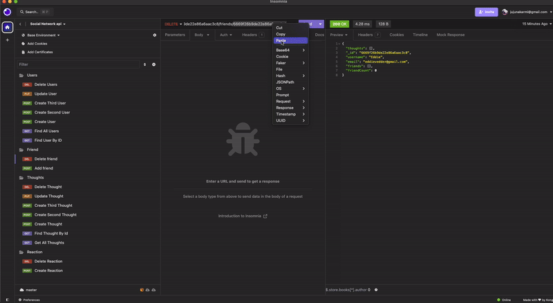
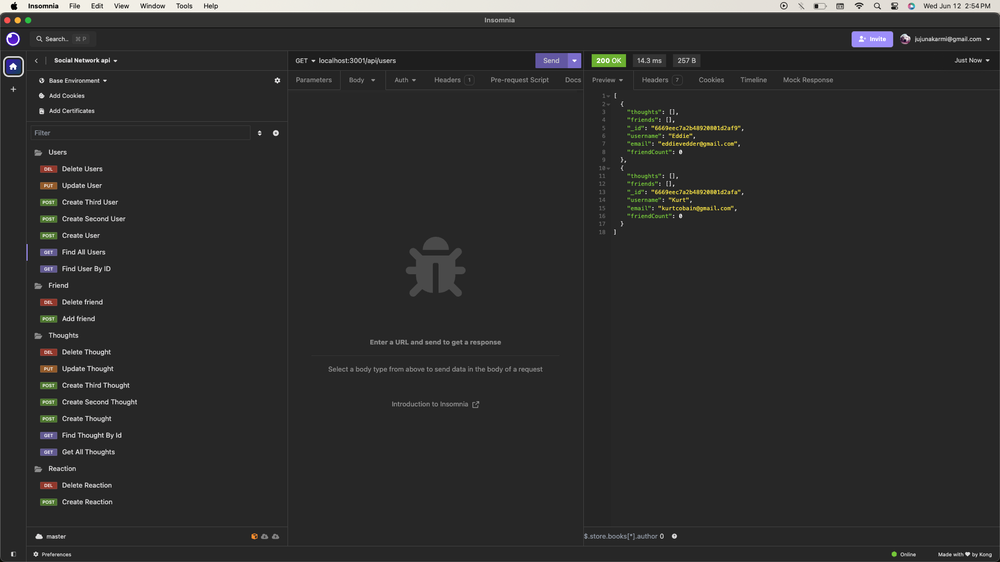
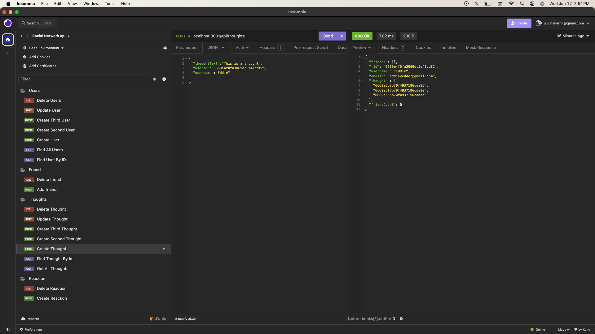
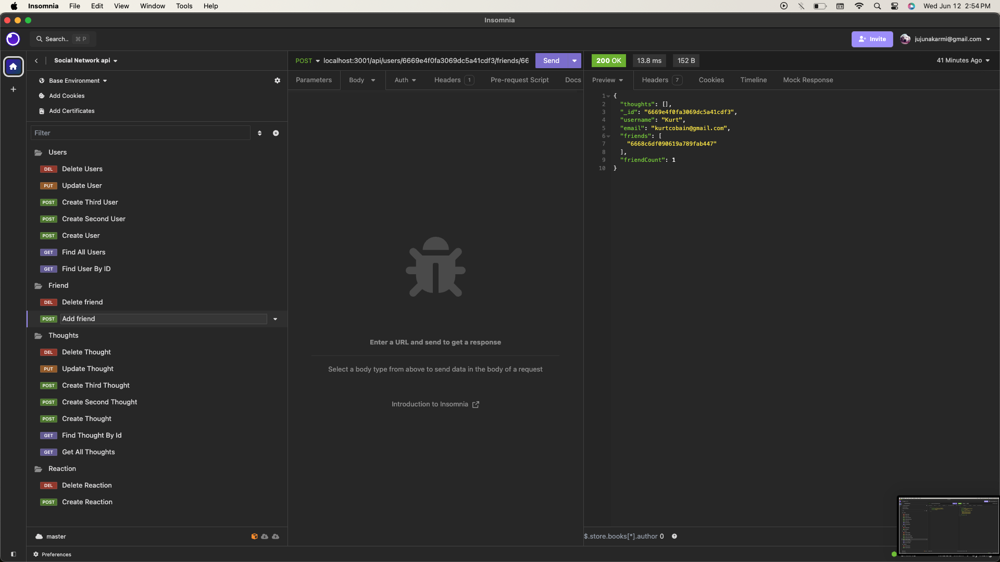

# Social-Network-API
[](https://www.javascript.com/) 
[](https://nodejs.org/en) 
[](https://expressjs.com/)
[](https://www.mongodb.com/) 


# Description
This repository is an exhibition of an API designed for a social network web application. The user can consult the repo to learn how to create an API for a social network web application, using the Mongoose object data modeling library (ODM). The project makes use of Node.js to work with a back end, the Express package to design and configure an API, the Api-Routes package to use a declarative system for creating express API routes, the Moment package to display dates, and the Mongoose package to effectively provide a schema-based solution to model application data.

Here is the demonstration of the application.
[Full Video demo of the application.](https://drive.google.com/file/d/1HWbqRnFTaaM7ntrFRWOY23RYOSW371kD/view?usp=sharing)



  ## Table of Contents

* [Installation](#installation)
* [Usage](#usage)
* [Screenshots](#screenshots)
* [License](#license)
* [Contributing](#contributing)
* [Contact](#contact)

## Installation
  1. Fork and clone repository to local machine. 
  2. Open integrated terminal in personal IDE.
  3. Run ```npm i``` to install dependencies in local project directory. 


## Usage

  1. Open integrated terminal in personal IDE.
  2. Run ```npm run start``` to start server on local port. 
  3. Test endpoints in API tester such as [Insomnia](https://insomnia.rest/).


## Screenshots
Here are some of the screenshots of the application.





## License
[](https://opensource.org/licenses/MIT)

## Contributing

There are no guidelines for contributing at this time. Contact me with any ideas or requests if anybody want to contribute.


## Contact
* Email: jujunakarmi@gmail.com
* LinkedIn:[https://www.linkedin.com/in/juju-nakarmi-1a79a7181/](https://www.linkedin.com/in/juju-nakarmi-1a79a7181/)